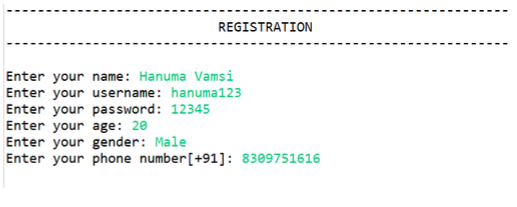
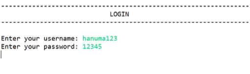
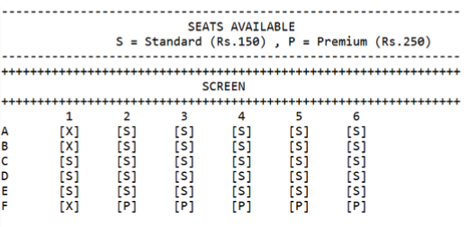
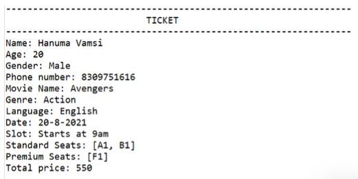
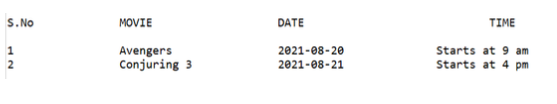

# Movie-Booking-System

- The Theatre booking system implemented by ABC Cinemas allows users to book tickets to movies that are currently running with an option to either pay online or at the counter. It also provides the user additional features like printing the ticket of an existing booking and deleting an existing booking.
- The project is designed using JAVA programming language with the help of object-oriented programming concepts.

## Problem definition
- The traditional way of booking a movie ticket requires the customer to go to the theater playing the desired movie and stand in a queue to book the same. The project aims to overcome this issue by automating the booking process, hence making the customer experience largely convenient and faster.
- The project is an automated online movie booking system implemented for ABC Cinemas, with various functionalities. It can be used by both new and existing customers.
- For every customer, the home page displays three options, register, login, and exit. A new customer would be required to register his personal information and subsequently, log in with their credentials to make a booking. The user will then be presented with the following features: Create a new booking, Print ticket for an existing booking, Cancel an existing booking, and Log out.
- If the user chooses to create a new booking, he/she will be required to enter their preferred movie, date and time slot. The user is now displayed with a seat matrix of the theatre and is required to choose their seats. This is then followed by the payment of this ticket which can be done either online or at the counter. The system then prints out the ticket for the user.
- If the user chooses to Cancel an existing ticket, the details of his previous bookings would be listed and the booking chosen by the user will be deleted. If no previous bookings are recorded, a message is printed accordingly.
- If the user chooses to print the ticket for an existing booking, the details of his previous bookings would be listed and the ticket for the booking chosen by the user will be printed. If no previous bookings are recorded, a message is printed accordingly.

## Results

- Registration

- Login

- Book Seats

- Ticket

- List of Bookings

